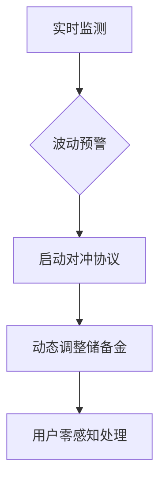

# BoF银行法币/加密货币交易所：融合数字与传统金融

## 数字与传统金融融合新体验

👉 [体验一站式数字资产管理](https://bit.ly/okx_welcome)

BoF银行推出的法币/加密货币交易所平台，为现代金融需求提供创新解决方案。通过将加密货币交易与传统金融体系深度融合，用户可在单一账户内实现数字资产与法币的高效流通。这套自主研发的金融基础设施，正在重塑企业及个人参与数字经济的全新模式。

### 核心功能矩阵
- **即时结算系统**：资金实时到账数字钱包
- **双向流通通道**：支持加密货币与法币无缝转换
- **风险管理机制**：专业级价格波动对冲方案
- **成本优化架构**：行业领先的低费率体系

## 核心功能深度解析

### 实时清算网络
我们的智能清算引擎确保每笔交易在区块链确认后**15秒内**完成入账。相较于行业平均30-60秒的处理时效，该技术显著提升资金周转效率，特别适用于高频交易场景。

| 功能维度   | 传统交易所 | BoF银行平台 |
|------------|------------|-------------|
| 平均到账时间 | 30-60秒    | ≤15秒       |
| 处理并发量   | 1000TPS    | 5000TPS     |
| 网络延迟     | 高峰期拥堵   | 动态负载均衡 |

👉 [探索更多技术优势](https://bit.ly/okx_welcome)

### 定制化汇率服务
针对企业用户特殊需求，我们提供三种汇率管理方案：
1. **固定汇率模式**：锁定交易价格，完全规避市场波动
2. **浮动汇率模式**：实时对接全球主流交易所数据
3. **混合汇率模式**：支持基础额度固定+超额浮动组合

**案例实证**：某跨境电商通过固定汇率模式，成功规避2023年Q2比特币25%的价格波动，节省汇兑损失超$120,000。

## 三大核心优势

### 资金效率革命
通过智能流动性池技术，实现：
- 法币提现手续费**0.15%**起
- 跨境转账时间从3天缩短至**45分钟**
- 多币种自动对冲系统降低30%运营成本

### 合规安全架构
- 通过ISO 27001认证的信息安全管理体系
- 冷热钱包分离存储，98%资产离线保存
- 多签钱包技术配合生物识别双重验证

### 企业级解决方案
| 服务模块       | 功能亮点                  |
|----------------|---------------------------|
| API对接系统    | 支持每秒10,000+请求处理   |
| 多账户管理     | 最高支持500个子账户创建   |
| 自定义报表     | 支持GDPR合规的数据导出    |
| 客服响应       | 7×24小时多语言支持团队    |

## 运作机制全解析

### 五步完成数字资产整合
1. **账户绑定**：关联现有银行账户与数字钱包
2. **资产转入**：支持20+主流加密货币及8种法币
3. **智能配置**：根据风险偏好设置自动转换规则
4. **交易执行**：通过API或网页端完成即时交易
5. **收益管理**：自动统计各币种收益与税务报表

### 风控系统运作流程

## 企业应用场景

### 跨境电商解决方案
某国际零售企业通过平台实现：
- 接受加密支付的同时自动转换为本地法币
- 减少中间银行手续费约$8,500/月
- 客户支付选择率提升40%

### 自媒体创作者收益
内容创作者可：
1. 接收全球粉丝加密打赏
2. 自动转换为稳定币结算
3. 直接提现至本地银行账户
4. 系统自动生成税务报表

## 常见问题解答

Q：如何确保汇率转换的透明度？
A：所有汇率数据源均来自CoinMarketCap、CoinGecko等三家权威平台的加权平均值，每10秒更新一次。

Q：遭遇极端行情时如何保障流动性？
A：我们的流动性池包含30%的法定货币储备+70%的主流加密资产，配合做市商协议确保极端行情下的兑付能力。

Q：个人用户是否有最低使用门槛？
A：完全免费开户，且支持零余额账户管理。首次交易限额为$500/日，通过KYC后可提升至$50,000/日。

Q：如何处理不同司法管辖区的合规要求？
A：我们采用动态合规引擎，自动适配130+国家的金融监管要求，包括FATF旅行规则、欧盟MiCA法规等。

## 迈向数字金融未来

👉 [开启您的数字资产旅程](https://bit.ly/okx_welcome)

BoF银行通过创新性地融合传统金融基础设施与区块链技术，正在构建新一代金融生态。我们的解决方案不仅解决当前加密货币应用的痛点，更为数字经济时代的企业和个人提供可持续发展的金融工具。
