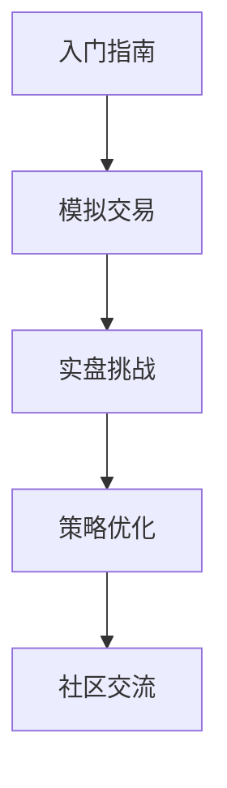

# OKX交易平台全面解析：功能、安全与交易策略指南

## 发展历程与市场定位

### 创始与转型
OKX于2014年以OKCoin之名诞生，最初专注于比特币现货交易。凭借简洁的界面和低廉的手续费迅速获得市场认可。2020年完成品牌升级，从单一交易平台转型为综合性数字资产生态体系。

### 全球化布局
目前OKX已在200多个国家和地区开展业务，日均交易量超过500亿美元。平台持续优化合规架构，在新加坡、马耳他等地设立区域总部，成为全球首家获得ISO/IEC 27001认证的加密货币交易所。

## 核心功能解析

### 多维度交易系统
| 交易类型 | 核心优势 | 适用人群 |
|---------|----------|----------|
| 现货交易 | 300+数字资产 | 新手投资者 |
| 期货合约 | 最高100倍杠杆 | 专业交易者 |
| 永续合约 | 零交割压力 | 长线持仓者 |
| 期权交易 | 多样化策略组合 | 机构投资者 |

### 流动性优势
平台深度整合全球TOP50交易所流动性，BTC/USDT交易对的滑点率长期保持在0.05%以下。通过智能路由系统实现跨市场最优报价撮合。

## 安全防护体系

### 五层防御机制
1. 冷热钱包分离（98%资产离线存储）
2. 生物识别+硬件令牌双重验证
3. 分布式DDoS防护网络
4. 智能风控引擎实时监控
5. 2000万美元保险基金兜底

**常见问题解答**
❓ *如何启用双重认证？*  
通过账户设置-安全中心，绑定Google Authenticator或短信验证即可完成。

❓ *被盗资金如何理赔？*  
平台保险基金可在确认安全事件后72小时内启动赔付流程，近3年累计赔付率达99.8%

## 智能交易工具

### 专业级分析系统
- 集成TradingView技术分析模块
- 30+内置技术指标（MACD、RSI、布林带等）
- 多周期K线组合（1分钟至1周粒度）

### 自动化交易解决方案
支持API接入及策略脚本开发，提供：
- 网格交易机器人
- 套利交易模块
- 事件驱动型策略模板

👉 [立即获取API开发文档](https://bit.ly/okx_welcome)

## 教育生态建设

### 新手成长路径

### 专家级内容矩阵
每月举办8场线上研讨会，覆盖：
- 宏观市场分析（每周五）
- 技术指标实战（每周三）
- 机构级风控策略（每月首周）

## 合规发展路线

### 全球合规布局
| 地区 | 合规进度 | 特色服务 |
|------|----------|----------|
| 欧盟 | MiCA认证进行中 | 法币出入金 |
| 新加坡 | MAS牌照持有者 | 机构托管服务 |
| 阿联酋 | FSRA监管沙盒 | 数字银行对接 |

### KYC升级体验
采用AI驱动的生物识别系统，完成标准验证平均耗时缩短至3.2分钟，支持护照/身份证/驾照等12种证件类型。

## 社区生态运营

### 激励计划
- 推荐返佣：最高30%手续费返还
- 交易大赛：周赛奖金池超50万美元
- 持币生息：主流币种年化收益达8%

👉 [参与本周交易大赛](https://bit.ly/okx_welcome)

### 多维社区触点
- Twitter：实时市场动态更新
- Telegram：专业策略讨论组
- Reddit：开发者AMA专场

## 未来发展趋势

### 技术革新方向
1. 零知识证明技术应用
2. AI驱动的智能投顾系统
3. 跨链资产互通协议

**常见问题解答**
❓ *如何参与社区治理？*  
持有OKB代币可参与社区投票，每月开放3个提案审议名额。

❓ *平台升级如何通知？*  
通过站内公告+APP推送+邮件三重提醒机制，重大升级提前7日预警。

## 交易者成功案例

### 典型应用场景
- 套利交易者：利用跨市场价差，日均完成150笔交易
- 长期投资者：通过定投功能累计持仓BTC增值300%
- 机构客户：使用API接口实现自动化做市商策略

👉 [查看成功案例详情](https://bit.ly/okx_welcome)

### 风险控制实践
- 设置动态保证金调整机制
- 强制平仓预警系统（提前1小时通知）
- 极端行情熔断保护

## 全球影响力数据

截至2025年Q1：
- 日均活跃用户：85万+
- 合约持仓量：28亿美元
- 社区开发者：12,000+成员
- 生态合作伙伴：300+区块链项目
