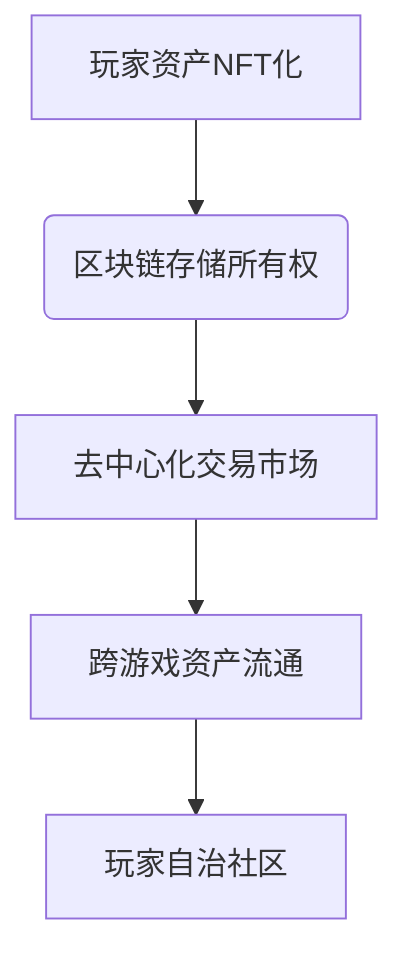

# 区块链技术深度解析：重塑数字时代的信任基石

## 什么是区块链技术？

区块链是一种基于密码学原理的分布式账本技术，通过去中心化网络实现交易记录、数据存储和价值交换。与传统中心化系统不同，其核心特征体现在：

- **分布式架构**：全球节点共同维护账本副本
- **密码学保障**：采用非对称加密确保数据安全
- **共识机制**：通过算法实现节点间信任建立
- **不可篡改性**：区块链数据经哈希加密形成永久记录

> 区块链不仅支撑着加密货币体系，更成为Web3.0时代构建信任基础设施的关键技术，其信任最小化特性正在重构数字时代的经济协作模式。

## 技术演进与核心价值

### 发展历程
区块链技术演进可分为三个阶段：
| 阶段 | 时间节点 | 核心特征 | 代表应用 |
|------|----------|----------|----------|
| 1.0  | 2008年   | 基础共识算法 | 比特币 |
| 2.0  | 2013年   | 智能合约功能 | 以太坊 |
| 3.0  | 2016年至今 | 跨链互操作 | Polkadot、Cosmos |

👉 [探索区块链技术最新发展动态](https://bit.ly/okx_welcome)

### 核心技术架构
区块链系统包含四大核心技术层：
1. **数据层**：链式区块结构+默克尔树
2. **网络层**：P2P协议实现节点通信
3. **共识层**：PoW/PoS等算法保障一致性
4. **合约层**：可编程的智能合约系统

## 运行机制解析

### 交易处理流程
用户交易需经过以下验证环节：
1. 数字签名验证（私钥匹配）
2. 余额充足性检查
3. 网络广播与节点验证
4. 共识机制确认
5. 区块上链存储

### 共识机制对比
主流共识算法特性比较：
| 机制类型 | 能耗 | 扩展性 | 安全性 | 代表项目 |
|----------|------|--------|--------|----------|
| 工作量证明(PoW) | 高 | 低 | 高 | 比特币 |
| 权益证明(PoS) | 中 | 中 | 高 | 以太坊2.0 |
| 委托权益证明(DPoS) | 低 | 高 | 中 | EOS |

## 应用场景全景图

### 核心应用领域
区块链技术已渗透多个行业领域：
- **金融服务**：跨境支付、去中心化借贷
- **供应链管理**：商品溯源、物流追踪
- **数字身份**：自管理身份认证系统
- **知识产权**：数字内容确权与交易
- **医疗健康**：电子病历安全共享

### 创新应用案例
区块链游戏经济系统架构示例：

## 技术挑战与发展方向

### 现存挑战
区块链技术发展面临三重挑战：
1. **可扩展性瓶颈**：比特币网络约7TPS vs 支付宝54万TPS
2. **监管合规难题**：全球监管政策差异显著
3. **用户体验短板**：钱包管理复杂度高

### 未来趋势
值得关注的三大发展方向：
- **分片技术**：以太坊2.0信标链实现架构升级
- **零知识证明**：Zcash等项目推动隐私计算
- **跨链协议**：构建多链互操作基础设施

👉 [了解区块链技术投资机遇](https://bit.ly/okx_welcome)

## FAQ常见问题解答

**Q：区块链如何确保数据安全？**  
A：通过密码学哈希函数+分布式存储实现，修改任一区块需同步更改后续所有区块并控制51%节点，技术上极难实现。

**Q：区块链与比特币的关系？**  
A：区块链是比特币的底层技术，类似发动机与汽车的关系。当前区块链应用已远超加密货币范畴。

**Q：私有链与公有链的本质区别？**  
A：公有链完全开放且去中心化，私有链由单一机构控制权限，联盟链则介于两者之间。

**Q：智能合约存在哪些风险？**  
A：主要风险包括代码漏洞（如重入攻击）、预言机数据源风险以及法律效力不确定性。

**Q：区块链如何改变传统行业？**  
A：通过消除中间环节降低交易成本，提高流程透明度，例如供应链金融可降低30%融资成本。

## 技术生态全景

区块链技术栈包含七个层级：
1. 基础协议层
2. 开发框架层
3. 中间件服务
4. 应用协议层
5. DApp应用
6. 交易平台
7. 辅助工具

## 投资与应用热点

2023年区块链投资热点领域：
- Web3基础设施（占比38%）
- NFT平台（25%）
- DeFi协议（19%）
- 元宇宙相关（12%）

👉 [把握区块链投资风口机遇](https://bit.ly/okx_welcome)

## 未来展望

区块链技术发展将经历三个阶段演进：
1. **价值互联网**（2020-2025）：数字货币与资产通证化
2. **契约互联网**（2025-2030）：智能合约全面应用
3. **秩序互联网**（2030+）：构建分布式自治社会基础设施

随着量子计算、AI等技术融合，区块链将推动人类进入可信计算新时代，其去中心化特性或将重塑数字时代的社会协作范式。