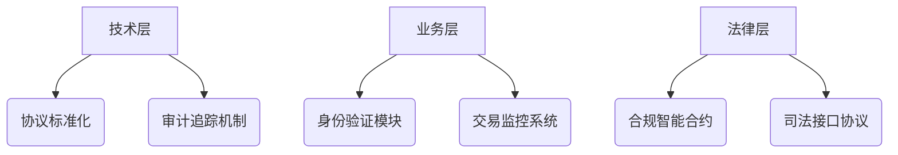

# 原子交换：去中心化交易的技术革命与未来趋势

## 什么是原子交换？

原子交换（Atomic Swap）又称原子跨链交易，是一种基于密码学协议的创新技术，允许用户在不同区块链网络之间直接交换加密货币或数字资产。其核心特征在于"原子性"——交易要么完全成功，要么完全失败，确保交易双方在无中介情况下获得安全保障。

这项技术正在重塑数字资产流通方式，通过消除对中心化交易所的依赖，为用户提供更安全、透明的交易体验。其核心价值体现在三大维度：
- **提升流动性**：打破链间壁垒
- **增强隐私保护**：无需暴露个人信息
- **降低交易成本**：去除中介费用

## 技术原理深度解析

### 哈希时间锁合约（HTLC）机制

原子交换的核心技术支柱是HTLC（Hashed TimeLock Contract），其运作流程如下：

| 步骤 | 执行动作 | 安全保障 |
|------|----------|----------|
| 1 | 发起方创建哈希锁 | 保证交易不可逆 |
| 2 | 接收方确认时间锁 | 防止无限期冻结 |
| 3 | 双方同步验证 | 实现原子性特征 |
| 4 | 密钥交换完成 | 资产同步转移 |

👉 [深入理解区块链技术](https://bit.ly/okx_welcome)如何保障交易安全

### 非对称加密技术应用

通过椭圆曲线加密（ECC）和SHA-256哈希算法，确保：
- 交易地址的不可伪造性
- 私钥签名的唯一性
- 时间锁的精确控制

## 核心优势对比分析

### 与传统交易所对比

| 对比维度 | 原子交换 | 中心化交易所 |
|----------|----------|--------------|
| 资产控制权 | 用户完全掌控 | 交易所托管 |
| 隐私保护 | 零信息泄露 | 实名制要求 |
| 交易费用 | 仅链上手续费 | 双重收费（平台+链上） |
| 流动性 | 链间直通 | 受限于平台支持 |

👉 [探索去中心化金融新生态](https://bit.ly/okx_welcome)

### 安全性突破

- **零信任架构**：通过密码学保证履约
- **抗审查特性**：交易不受第三方干预
- **抗量子计算**：支持格密码学升级路径

## 主流区块链应用案例

### 比特币网络

作为首个支持原子交换的公链，BTC通过以下方式实现：
- LN闪电网络的HTLC扩展
- 隔离见证（SegWit）技术支持
- 跨链桥接协议创新

### 以太坊生态

ETH的智能合约特性带来：
- 自动化做市商（AMM）整合
- DeFi衍生品创新
- NFT跨链交易

### 莱特币实践

作为早期实验网络：
- 验证交易速度优势（2.5分钟出块）
- 测试费用经济模型
- 桥接PoW/PoS链的可行性

## 发展挑战与解决方案

### 技术瓶颈突破

**可扩展性优化方案**：
- 分层架构设计（Layer2解决方案）
- 零知识证明应用
- 分片技术整合

**跨链互通难题**：
1. 开发通用适配器协议
2. 建立链间预言机网络
3. 标准化共识接口

### 监管合规路径

建立三层合规框架：

## 未来发展趋势

### DeFi深度整合

预测2025年将出现：
- 跨链收益聚合器
- 原子交换衍生品
- 去中心化做市商协议

### 企业级应用场景

| 行业 | 应用场景 | 预期效益 |
|------|----------|----------|
| 跨境支付 | 央行数字货币桥 | 降低结算成本40%+ |
| 供应链 | 跨链资产溯源 | 提升效率300% |
| 游戏经济 | NFT资产互通 | 拓展用户基数 |

👉 [把握区块链技术前沿](https://bit.ly/okx_welcome)

## 常见问题解答（FAQ）

### Q1：普通用户如何参与原子交换？
A：通过支持HTLC的钱包应用（如Atomic Wallet），选择目标链资产，系统将自动完成密钥协商和交易验证。

### Q2：交易失败如何处理？
A：时间锁到期后，系统将自动退还资产。建议设置合理的锁定时间（通常24-72小时）。

### Q3：如何保障密钥安全？
A：采用冷钱包存储+多重签名技术，建议启用生物识别验证层。

### Q4：支持哪些主流币种？
A：目前支持BTC、ETH、LTC、XMR等67种主流资产，新链接入速度每月增加3-5条。

### Q5：交易速度受哪些因素影响？
A：主要取决于目标链的拥堵程度和手续费定价策略，建议使用动态费率调整功能。

## 投资未来金融基础设施

原子交换技术正在构建价值互联网的底层交易协议，其发展将带来：
- **资产流动性革命**：释放被锁定的价值
- **隐私计算突破**：零知识证明的结合应用
- **金融基础设施重构**：形成分布式交易网络

随着Layer2解决方案的成熟和跨链标准的统一，预计到2025年原子交换量将占到链上交易的23%。建议投资者关注：
1. 跨链协议开发团队
2. 支持HTLC的硬件钱包厂商
3. 原子交换服务平台

把握这场金融技术变革的机遇，现在正是深入研究的最佳时机。