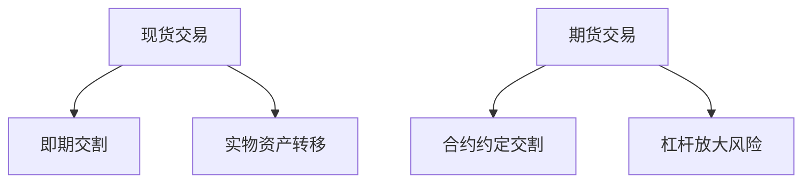

# 如何在KuCoin将ETH转换为USDT：加密货币交易操作指南

## 一、KuCoin平台ETH转USDT全流程解析

### 1.1 账户准备与资产转移
**操作步骤：**
1. 确保账户内有ETH（可通过外部钱包转入或平台购买）
2. 在"资产"页面将ETH从主账户划转至交易账户
3. 进入现货交易界面选择ETH/USDT交易对

### 1.2 交易执行策略对比
| 订单类型 | 适用场景 | 价格控制 | 执行速度 |
|---------|----------|----------|----------|
| 限价单   | 精准定价交易 | 高       | 视市场情况 |
| 市价单   | 即时成交需求 | 低       | 立即执行 |

👉 [如何选择最佳交易策略](https://bit.ly/okx_welcome)

### 1.3 订单确认与资产到账
完成交易后USDT将即时存入交易账户，可通过"资产"页面划转至主账户进行提现或再投资。

## 二、加密货币交易核心认知

### 2.1 交易机制深度解析
**三大关键要素：**
- 价格发现系统：实时匹配买卖订单
- 流动性池：保障交易即时执行
- 安全清算：确保资产转移无误

### 2.2 现货与期货交易差异

👉 [如何规避期货交易风险](https://bit.ly/okx_welcome)

## 三、伊斯兰金融合规性探讨

### 3.1 金融活动三大禁区
- **Riba（利息）**：禁止任何形式的利息收益
- **Gharar（不确定性）**：规避信息不对称交易
- **Maysir（投机）**：反对纯粹概率性获利

### 3.2 稳定币USDT的特殊考量
需重点核查：
1. 储备资产构成（是否包含利息资产）
2. 发行方审计透明度
3. 交易场景的合规性

## 四、账户安全防护体系构建

### 4.1 多层验证机制
**安全配置建议：**
- 启用Google Authenticator（替代短信验证）
- 设置独立交易密码
- 开通防钓鱼验证

### 4.2 资金管理策略
**风险控制措施：**
- 设置提现地址白名单
- 分散存储（主账户/交易账户分离）
- 定期审查登录设备

## 五、交易成本优化方案

### 5.1 手续费结构解析
| 用户等级 | 制造者费率 | 接受者费率 | KCS抵扣优惠 |
|---------|------------|------------|------------|
| VIP0    | 0.10%      | 0.10%      | 20%折扣    |
| VIP5    | 0.06%      | 0.08%      | 30%折扣    |
| VIP10   | 0.00%      | 0.02%      | 50%折扣    |

👉 [如何实现零手续费交易](https://bit.ly/okx_welcome)

### 5.2 KCS代币价值分析
持有KCS可享受：
- 交易费折扣（最高50%）
- 每日交易手续费分红
- 专属活动参与权

## 六、USDT资产管理策略

### 6.1 数字资产存储方案
**存储方式对比：**
| 类型       | 安全等级 | 适用场景       | 推荐比例 |
|------------|----------|----------------|----------|
| 硬件钱包   | ★★★★★    | 长期持有       | 70%      |
| 软件钱包   | ★★★☆☆    | 日常交易       | 20%      |
| 交易所存储 | ★★☆☆☆    | 短期套利       | 10%      |

### 6.2 合规增值路径
**推荐实践：**
- 参与伊斯兰合规DeFi项目
- 支持慈善捐赠（Sadaqah）
- 实物资产锚定投资

## 七、风险防控与合规建议

### 7.1 市场风险应对策略
**波动管理三原则：**
1. 设置止损/止盈点位
2. 保持30%流动性储备
3. 定期调整资产配置

### 7.2 监管动态跟踪
重点关注：
- 各国央行数字货币政策
- 反洗钱（AML）新规
- 交易所合规认证

## 常见问题解答（FAQ）

**Q1：转换ETH到USDT需要什么前置条件？**  
A：需完成基础身份验证（KYC），确保账户内有可交易ETH。

**Q2：最小交易量是多少？**  
A：ETH/USDT交易对最低限额为0.001 ETH，约合3美元。

**Q3：如何查看交易记录？**  
A：在"订单历史"页面可查询所有交易明细，包括时间、价格、数量等信息。

**Q4：转换过程需要多长时间？**  
A：市价单即时成交，限价单视市场价格波动可能需要数分钟至数小时。

**Q5：如何保障转换过程的资金安全？**  
A：建议启用双重验证、设置交易密码、定期检查登录记录。

**Q6：转换后如何提取USDT？**  
A：可通过"提币"功能将USDT转至个人钱包，注意选择正确的网络协议（ERC-20/TRC-20）。

👉 [如何安全提币全流程指南](https://bit.ly/okx_welcome)