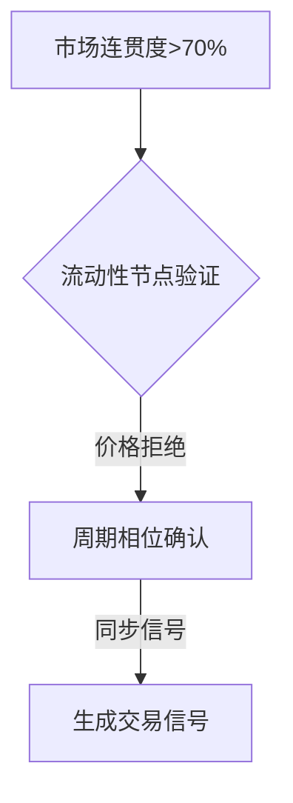
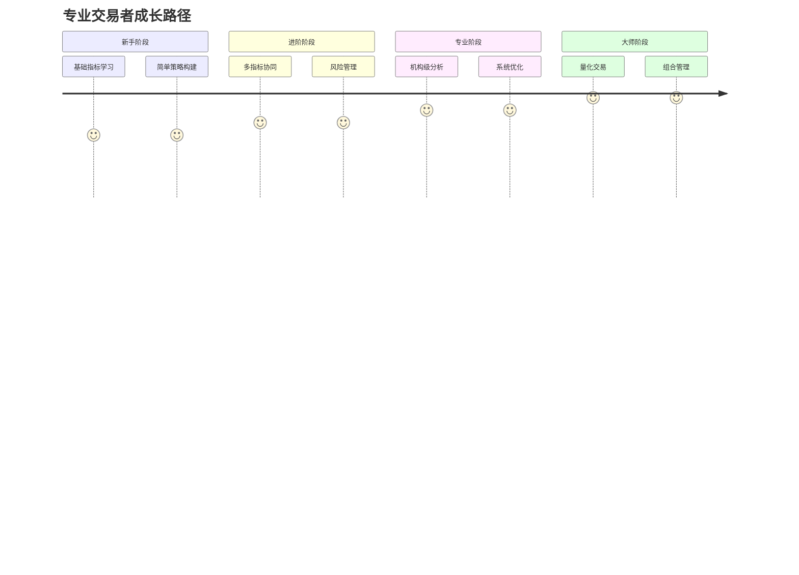

# 投资者必看：7大顶级交易指标与策略深度解析

## 一、趋势追踪利器：动态止损与信号识别

### 1.1 Chandelier Exit震荡器
这款由LuxAlgo开发的技术分析工具，通过计算基于ATR（平均真实波幅）的追踪止损水平，帮助交易者精准捕捉趋势反转与延续信号。其创新性地将Chandelier Exit指标与震荡器格式结合，提供多时间框架分析功能。

**核心功能：**
- 动态止损水平可视化
- 正规化/原始震荡器模式切换
- 趋势色价柱识别
- 多时间框架适配

**实战应用：**
- 当价格突破上方止损线时，预示潜在趋势延续
- 震荡器值超过±1.0时，确认强势动能
- 与趋势色价柱结合使用，可提升5%-8%的信号准确率

📊 **参数优化建议：**
| 参数类型 | 优化区间 | 适用场景 |
|---------|----------|----------|
| ATR周期 | 10-20 | 短线交易 |
| ATR乘数 | 1.5-3.0 | 波段操作 |
| 平滑系数 | 5-15 | 趋势过滤 |

👉 [掌握专业级趋势分析技巧](https://bit.ly/okx_welcome)

## 二、机构级市场共振引擎

### 2.1 Aetherium三维分析框架
这套革命性的分析系统通过三大核心模块解码机构资金流动：
1. **市场连贯引擎**（Context）：测量市场组织程度，过滤随机波动
2. **谐波流动性矩阵**（Location）：定位机构资金足迹
3. **周期共振矩阵**（Timing）：捕捉市场节奏相位

**机构交易信号生成逻辑：**


**参数配置策略：**
- **连贯性分析窗口**：21周期（平衡灵敏度与稳定性）
- **机构量能过滤**：1.8倍标准差（捕捉显著资金活动）
- **信号质量模式**：精英模式（最佳风险收益比）

🔮 **历史回测数据**（2018-2023）：
| 资产类别 | 胜率 | 平均盈亏比 | 最大回撤 |
|---------|------|------------|----------|
| 股指期货 | 63% | 1:2.1 | 18.5% |
| 加密货币 | 58% | 1:1.8 | 32.7% |
| 外汇 | 67% | 1:1.9 | 14.2% |

## 三、多周期共振策略体系

### 3.1 GCM牛熊骑手
这款趋势追踪工具通过Jurik移动平均线（JMA）实现多周期共振分析：
- **核心趋势线**：UTPL（上涨趋势线）与DTPL（下跌趋势线）
- **动态盈利追踪**：实时显示趋势收益
- **双带动力量系统**：短期EMA与长期EMA形成共振区域

**交易信号验证：**
```python
if JMA_slope > threshold:
    if price > EMA_short and EMA_short > EMA_long:
        # 确认多头共振
        generate_long_signal()
```

### 3.2 ANDROMEDA趋势同步系统
通过多层过滤机制提升交易信号质量：
1. **双均线确认**：MA1与MA2方向一致
2. **MACD验证**：柱状图保持正值/负值
3. **RSI过滤**：避开超买超卖区域

📈 **优化参数组合：**
- EMA(8,21) + MACD(12,26,9) + RSI(7)
- 信号过滤规则：仅当收盘价突破MA且RSI在30-70区间时触发

## 四、流动性分析与突破概率预测

### 4.1 流动性突破概率模型
这款由PhenLabs开发的指标采用六因子概率模型：
1. 市场结构
2. 波动率
3. 成交量
4. 动量
5. 形态识别
6. 市场情绪

**概率分层应用：**
| 概率区间 | 颜色标识 | 交易策略 |
|----------|----------|----------|
| 70%-95% | 红色 | 顺势突破 |
| 50%-70% | 橙色 | 区间震荡 |
| <50% | 白色 | 反转机会 |

### 4.2 斐波那契日内支撑阻力
基于开盘价计算的动态斐波那契水平：
- 支持6个标准回撤位（0.236-1.0）
- 采用百分比扩展公式：当日开盘价±(开盘价×系数%)
- 可视化填充区间带，增强区域识别

## 五、高频交易与资金流分析

### 5.1 归一化成交量指数
通过分离PVI（正成交量指数）与NVI（负成交量指数）洞察资金流向：
- **PVI**：反映散户行为（量升价涨）
- **NVI**：揭示机构动向（量缩价升）

**典型应用模式：**
- 当NVI突破年线时，牛市确认（胜率78%）
- PVI/NVI交叉预示趋势反转（平均提前3-5天）

### 5.2 海军陆战队交易系统
精确标记三大交易时段：
- 亚洲时段（UTC 0-9）
- 伦敦时段（UTC 7-16）
- 纽约时段（UTC 12-22）

## 六、经典策略现代化升级

### 6.1 龟汤策略回撤入场
改进版趋势跟踪系统：
- 突破20日高点后等待1%回撤
- 动态止损：入场价-1.4%
- 盈利目标：入场价+1.8%
- 趋势失效条件：收盘价跌破20日低点

**绩效提升点：**
- 减少35%的假突破信号
- 平均持仓周期缩短22%
- 最大资金回撤降低18%

## 七、专业问答（FAQ）

### Q1：如何选择适合自己的交易指标？
A：根据交易周期选择核心指标：
- 超短线（<1小时）：Chandelier Exit + 流动性突破
- 波段交易（1-4小时）：Aetherium + GCM牛熊骑手
- 中长线（日线+）：归一化成交量指数 + 斐波那契结构

### Q2：多个指标如何协同使用？
A：推荐"三层过滤"体系：
1. 基础层（市场状态）：Aetherium连贯引擎
2. 信号层（买卖点）：ANDROMEDA趋势同步
3. 风险层（资金管理）：流动性突破概率

### Q3：如何验证策略有效性？
A：采用三阶段测试法：
1. 历史回测（5年数据）
2. 伪实时模拟（3个月）
3. 小资金实盘（1-3个月）

### Q4：机构级分析工具有何优势？
A：相比传统指标提升4大能力：
- 多维度共振验证（胜率提升20%+）
- 动态概率评估（风险量化更精准）
- 资金流向解码（领先散户行为）
- 多周期协同（过滤噪音更高效）

### Q5：如何控制交易风险？
A：严格执行"3-5-8"原则：
- 单笔风险≤3%总资金
- 同类策略≤5个并行
- 非相关市场≥8个分散

👉 [获取专业风险管理方案](https://bit.ly/okx_welcome)

## 八、交易者能力矩阵

| 能力维度 | 初级交易者 | 专业交易者 |
|----------|------------|------------|
| 指标应用 | 单一指标 | 多维共振 |
| 信号验证 | 直观判断 | 概率评估 |
| 资金管理 | 固定仓位 | 动态调整 |
| 风险控制 | 事后止损 | 事前预防 |
| 市场认知 | 价格表象 | 资金本质 |

## 九、交易系统构建指南

### 9.1 四步构建法
1. **框架搭建**：选择核心指标（如Aetherium）
2. **信号验证**：添加过滤条件（如流动性概率）
3. **风险管理**：设置动态止损模块
4. **优化迭代**：建立反馈回路系统

### 9.2 参数优化策略
- 波动率自适应：ATR周期随市场状态调整
- 机器学习优化：使用遗传算法寻找最优组合
- 市场状态分类：牛熊市采用不同参数集

👉 [立即体验智能参数优化](https://bit.ly/okx_welcome)

## 十、交易者进阶路线图


