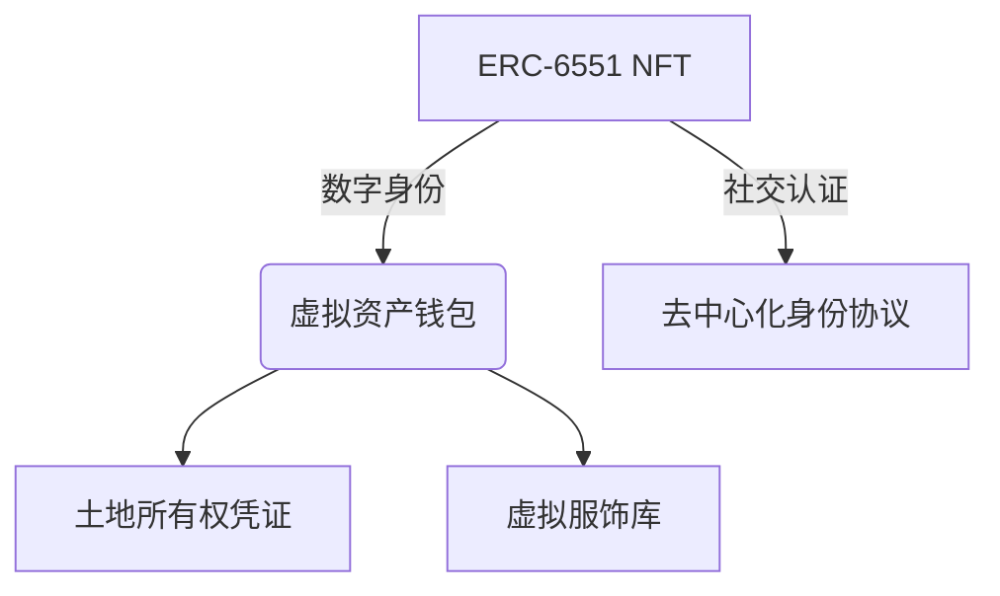

# 解析以太坊三大热门技术标准：EIP-6969、ERC-721C与ERC-6551

## 以太坊标准演进的行业意义

在区块链技术快速迭代的2024年，以太坊生态的三大创新标准EIP-6969、ERC-721C和ERC-6551正引发行业深度讨论。这些技术方案不仅重塑着智能合约与数字资产的交互方式，更预示着Web3.0生态的底层架构革新。本文将从技术原理、应用场景及行业影响三个维度进行深度解析。

👉 [了解区块链底层技术发展动态](https://bit.ly/okx_welcome)

## EIP-6969：重构智能合约激励机制

### 技术原理与创新
作为EIP-1559的升级方案，EIP-6969引入了**合约保护收入（CSR）机制**。该方案通过修改Gas费分配模型，在原有燃烧机制、基础费用、优先费用基础上，新增**智能合约开发者分成**模块。具体分配结构如下：

| 费用类型        | 分配比例 | 主要用途               |
|-----------------|----------|------------------------|
| 燃烧费用        | 动态调整 | 通缩机制               |
| 基础费用        | 动态调整 | 验证者奖励             |
| 优先费用        | 用户自定 | 交易优先级提升         |
| 合约分成        | 5-15%    | 开发者激励             |

### 应用场景分析
该方案特别适用于**Layer2扩展生态**，通过经济激励：
- 鼓励开发者优化合约效率
- 降低恶意合约攻击风险
- 构建可持续发展的开发者生态

👉 [探索以太坊L2生态最新进展](https://bit.ly/okx_welcome)

### 争议与挑战
- **安全性考量**：需建立合约质量评估体系
- **经济模型风险**：可能引发Gas费市场波动
- **实施路径争议**：当前优先部署于Optimism等L2网络

## ERC-721C：NFT版税制度的链上革命

### 技术突破点
该标准通过智能合约实现**可编程版税机制**，主要创新包括：
1. **条件支付系统**：支持基于交易价格、时间等维度的触发条件
2. **收益权分离**：创作者所有权与收益权可独立流转
3. **多级分配架构**：支持创作者、铸造者、社区等多方分成

### 商业模式创新
| 应用场景       | 实现方式                     | 典型案例               |
|----------------|------------------------------|------------------------|
| 游戏道具经济   | 稀有道具交易抽成             | Axie Infinity道具系统  |
| 艺术品市场     | 二次销售版税保护             | SuperRare创作者收益池  |
| 社交代币经济   | 内容创作激励分成             | Mirror平台创作者基金   |

### 行业影响分析
- **创作者经济**：预计使优质内容创作者收益提升30%-50%
- **平台权力重构**：减少OpenSea等中心化平台的规则控制
- **合规性提升**：自动执行的链上协议降低法律纠纷风险

## ERC-6551：NFT的智能化跃迁

### 核心技术创新
通过引入**绑定账户系统（TBA）**，该标准实现：
- NFT持有资产：支持跨合约资产托管
- 交互能力升级：具备独立签名交易能力
- 动态属性更新：基于外部数据自动调整状态

### 应用场景突破
**元宇宙身份系统**：

**DeFi深度整合**：
- NFT质押生成流动性凭证
- 跨协议资产组合管理
- 可编程收益分配机制

### 技术挑战与展望
- **安全审计需求**：智能合约风险评估体系需升级
- **性能优化空间**：当前交易确认速度比传统NFT慢20%
- **标准化进程**：正在推进与ERC-1155的兼容方案

## 标准体系对比分析

| 标准类型 | 主要功能               | 开发进度       | 潜在市场规模   | 主要风险               |
|----------|------------------------|----------------|----------------|------------------------|
| EIP-6969 | 合约开发者激励         | L2测试网运行   | 50亿美元+      | 经济模型稳定性         |
| ERC-721C | 可编程版税系统         | 主网部署       | 300亿美元+     | 平台方利益冲突         |
| ERC-6551 | NFT账户系统升级        | 生态适配阶段   | 80亿美元+      | 技术实现复杂度         |

👉 [参与区块链技术标准讨论](https://bit.ly/okx_welcome)

## FAQ：行业热点问题解答

**Q：这些标准对普通用户有何影响？**
A：将带来更安全的DApp体验（EIP-6969）、保障创作者权益的NFT市场（ERC-721C），以及具备完整金融功能的数字资产（ERC-6551）。

**Q：如何判断标准是否会被广泛采用？**
A：关键观察指标包括：头部项目集成情况、Gas费消耗占比、开发者工具支持度，以及合规性认证进展。

**Q：实施过程中可能遇到哪些阻力？**
A：主要挑战来自现有利益格局调整（如NFT平台版税模式变革）、技术兼容性问题，以及监管政策的不确定性。

**Q：哪些领域将最先受益？**
A：预计游戏公链、创作者经济平台、DeFi衍生品市场将率先实现规模化应用。

**Q：普通投资者应如何参与？**
A：建议关注标准基础设施提供商、头部DApp迁移进度，以及合规化程度高的应用场景项目。

## 未来演进趋势

1. **跨标准协同**：EIP-6969与ERC-6551的结合将催生新型智能资产
2. **监管框架完善**：各国央行数字货币（CBDC）与智能合约标准的对接